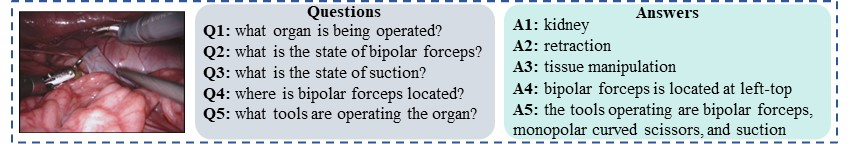
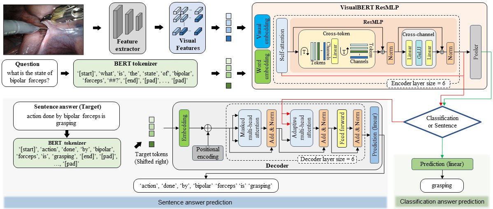
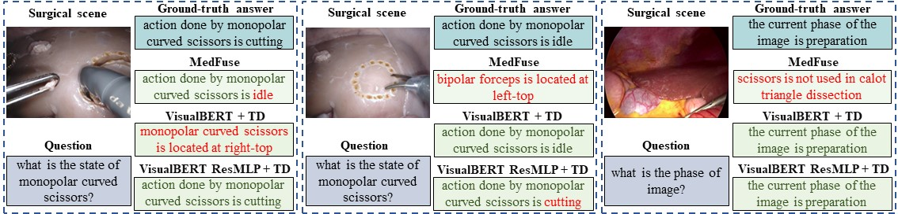

<div align="center">

<samp>

<h2> Surgical-VQA: Visual Question Answering in Surgical Scenes using Transformer </h1>

<h4> Lalithkumar Seenivasan*, Mobarakol Islam*, Adithya K Krishna and Hongliang Ren </h3>

</samp>   

---
| **[[```arXiv```](<https://arxiv.org/abs/2206.11053>)]** | **[[```Paper```](<https://link.springer.com/chapter/10.1007/978-3-031-16449-1_4>)]** | **[[```Video```](<https://youtu.be/4Db8NSEW-FY>)]**|
|:-------------------:|:-------------------:|:-------------------:|
    
The International Conference on Medical Image Computing and Computer Assisted Intervention (MICCAI) 2022
---

</div>     
    
---

If you find our code or paper useful, please cite our paper:

```bibtex
@InProceedings{10.1007/978-3-031-16449-1_4,
author="Seenivasan, Lalithkumar
and Islam, Mobarakol
and Krishna, Adithya K.
and Ren, Hongliang",
editor="Wang, Linwei
and Dou, Qi
and Fletcher, P. Thomas
and Speidel, Stefanie
and Li, Shuo",
title="Surgical-VQA: Visual Question Answering in Surgical Scenes Using Transformer",
booktitle="Medical Image Computing and Computer Assisted Intervention -- MICCAI 2022",
year="2022",
publisher="Springer Nature Switzerland",
address="Cham",
pages="33--43",
isbn="978-3-031-16449-1"
}
```

---
## Abstract
Visual question answering (VQA) in surgery is largely unexplored. Expert surgeons are scarce and are often overloaded with clinical and academic workloads. This overload often limits their time answering questionnaires from patients, medical students or junior residents related to surgical procedures. At times, students and junior residents also refrain from asking too many questions during classes to reduce disruption. While computer-aided simulators and recording of past surgical procedures have been made available for them to observe and improve their skills, they still hugely rely on medical experts to answer their questions. Having a Surgical-VQA system as a reliable ‘second opinion’ could act as a backup and ease the load on the medical experts in answering these questions. The lack of annotated medical data and the presence of domain-specific terms has limited the exploration of VQA for surgical procedures. In this work, we design a Surgical-VQA task that answers questionnaires on surgical procedures based on the surgical scene. Extending the  MICCAI endoscopic vision challenge 2018 dataset and workflow recognition dataset further, we introduce two Surgical-VQA datasets with classification and sentence-based answers. To perform Surgical-VQA, we employ vision-text transformers models. We further introduce a residual MLP-based VisualBert encoder model that enforces interaction between visual and text tokens, improving performance in classification-based answering. Furthermore, we study the influence of the number of input image patches and temporal visual features on the model performance in both classification and sentence-based answering.

<p align="center">

</p>


## VisualBert ResMLP for Classification and Sentence Generation
In our proposed VisualBERT ResMLP encoder model, we aim to further boost the interaction between the input tokens for vision-and-language tasks. The VisualBERT [1] model relies primarily on its self-attention module in the encoder layers to establish dependency relationships and allow interactions among tokens. Inspired by residual MLP (ResMLP) [2], the intermediate and output modules of the VisualBERT [15] model are replaced by cross-token and cross-channel modules to further enforce interaction among tokens. In the cross-token module, the inputs word and visual tokens are transposed and propagated forward, allowing information exchange between tokens. The resultant is then transposed back to allow per-token forward propagation in the cross-channel module. Both cross-token and cross-channel modules are followed by element-wise summation
with a skip-connection (residual-connection), which are layer-normalized. 

<p align="center">

</p>

## Results

<p align="center">

</p>

## Conclusion
We design a Surgical-VQA algorithm to answer questionnaires on surgical tools, their interactions and surgical procedures based on our two novel SurgicalVQA datasets evolved from two public datasets. To perform classification and sentence-based answering, vision-text attention-based transformer models are employed. A VisualBERT ResMLP transformer encoder model with lesser model parameters is also introduced that marginally outperforms the base vision-text attention encoder model by incorporating a cross-token sub-module. The influence of the number of input image patches and the inclusion of temporal visual features on the model’s performance is also reported. While our Surgical-VQA task answers to less-complex questions, from the application standpoint, it unfolds the possibility of incorporating open-ended questions where the model could be trained to answer surgery-specific complex questionnaires. From the model standpoint, future work could focus on introducing an asynchronous training regime to incorporate the benefits of the cross-patch sub-module without affecting the self-attention sub-module in sentence-based answer-generation tasks.

---

### Conda Environment

```bash
conda env create --name svqa --file=env.yaml
```

---
## Directory Setup
Refer to 'directory_setup.txt' file.

---
## Dataset

1. Med-VQA (C1, C2 & C3)
    - Image frame and question & answer pairs - **[[`Med-VQA Challenge`](https://ceur-ws.org/Vol-2380/paper_272.pdf)]** **[[`MedFuseNet Paper`](https://www.nature.com/articles/s41598-021-98390-1#ref-CR10)]**
2. EndoVis-18-VQA **[[`EndoVis-18-VQA Q&A pair annotation`](https://drive.google.com/drive/folders/1hu_yK27Xz2_lvjjZ97-WF2MK_JO14MWI?usp=sharing)]**
    - Images
    - Classification
    - Sentence
3. Cholec80-VQA **[[`Cholec80-VQA Q&A pair annotation`](https://drive.google.com/drive/folders/1QAqCEi_tMY9n3b37on0w6vr03cHom2ls?usp=sharing)]**
    - Images
    - Classification Task: Question & answer pairs annotation
    - Sentence Task: Question & answer pairs annotation
---

## Training
- Classification
    - Arguments: 
        - lr : EndoVis-18-VQA = 0.00001, Cholec80-VQA = 0.000005 and Med-VQA = 0.000005.
        - dataset_type: EndoVis-18-VQA = 'm18', Cholec80-VQA = 'c80' and Med-VQA = 'med_vqa'.
        - dataset_cat: Only for VQA-Med, Category 1 = 'cat1', Category 2 = 'cat2' and Category 3 = 'cat3'.
        - transformer_ver: VisualBert = 'vb' and VisualBertResMLP= 'vbrm'.
        - tokenizer_ver:  'v2'.
        - patch_size: Depends on the patch size you are using, default is set to 5x5 patches.
        - question_len: Depends on the question length you set, default is set to 25.
    
    - Training VisualBert-based classifier on EndoVis18-VQA dataset:
    ```bash
    python3 train_classification.py train.py --lr=0.00001 --checkpoint_dir='checkpoints/vb/m18/vb_' \
                                             --dataset_type='m18' --patch_size=5 \
                                             --tokenizer_ver='v2' --model_ver='vb'
    ```
    - Training VisualBert-based classifier on Cholec80-VQA dataset:
    ```bash
    python3 train_classification.py train.py --lr=0.000005 --checkpoint_dir='checkpoints/vb/c80/vb_' \
                                             --dataset_type='c80' --patch_size=5 \
                                             --tokenizer_ver='v2' --model_ver='vb'
    ```
    - Training VisualBert-based classifier on Med-VQA category 1 dataset:
    ```bash
    python3 train_classification.py train.py --lr=0.000005 --checkpoint_dir='checkpoints/vb/med-vqa/vb_' \
                                             --dataset_type='med_vqa' --dataset_cat='cat1' --patch_size=5\
                                             --tokenizer_ver='v2' --model_ver='vb'
    ```
    - Training VisualBertResMLP-based classifier on EndoVis18-VQA dataset:
    ```bash
    python3 train_classification.py train.py --lr=0.00001 --checkpoint_dir='checkpoints/vbrm/m18/vbrm_' \
                                             --dataset_type='m18' --patch_size=5 \
                                             --tokenizer_ver='v2' --model_ver='vbrm'
    ```
    - Training VisualBertResMLP-based classifier on Cholec80-VQA dataset:
    ```bash
    python3 train_classification.py train.py --lr=0.000005 --checkpoint_dir='checkpoints/vbrm/c80/vbrm_' \
                                             --dataset_type='c80' --patch_size=5 \
                                             --tokenizer_ver='v2' --model_ver='vbrm'
    ```
    - Training VisualBertResMLP-based classifier on Med-VQA category 1 dataset:
    ```bash
    python3 train_classification.py train.py --lr=0.000005 --checkpoint_dir='checkpoints/vbrm/med-vqa/vbrm_' \
                                             --dataset_type='med_vqa' --dataset_cat='cat1' --patch_size=5\
                                             --tokenizer_ver='v2' --model_ver='vbrm'
    ```

- Sentence
    - Arguments: 
        - lr : EndoVis-18-VQA = 0.00005 and Cholec80-VQA = 0.000001.
        - dataset_type: EndoVis-18-VQA = 'm18', Cholec80-VQA = 'c80'.
        - transformer_ver: VisualBert = 'vb' and VisualBertResMLP= 'vbrm'.
        - tokenizer_ver:  'v2'.
        - patch_size: Depends on the patch size you are using, default is set to 5x5 patches.
        - question_len: Depends on the question length you set, default is set to 25.

    - Training VisualBert-based sentence answer generator on EndoVis18-VQA dataset:
    ```bash
    python3 train_sentence.py train.py --lr=0.00001 --checkpoint_dir='checkpoints/vb_sen/m18/vb_' \
                                             --dataset_type='m18' --patch_size=5 \
                                             --tokenizer_ver='v2' --model_ver='vb'
    ```
    - Training VisualBert-based sentence answer generator on Cholec80-VQA dataset:
    ```bash
    python3 train_sentencen.py train.py --lr=0.000005 --checkpoint_dir='checkpoints/vb_sen/c80/vb_' \
                                             --dataset_type='c80' --patch_size=5 \
                                             --tokenizer_ver='v2' --model_ver='vb'
    ```

    - Training VisualBertResMLP-based sentence answer generator  on EndoVis18-VQA dataset:
    ```bash
    python3 train_sentence.py train.py --lr=0.00001 --checkpoint_dir='checkpoints/vbrm_sen/m18/vbrm_' \
                                             --dataset_type='m18' --patch_size=5 \
                                             --tokenizer_ver='v2' --model_ver='vbrm'
    ```
    - Training VisualBertResMLP-based sentence answer generator  on Cholec80-VQA dataset:
    ```bash
    python3 train_sentence.py train.py --lr=0.000005 --checkpoint_dir='checkpoints/vbrm_sen/c80/vbrm_' \
                                             --dataset_type='c80' --patch_size=5 \
                                             --tokenizer_ver='v2' --model_ver='vbrm'
    ```
---
## Evaluation
- Sentence    
    - Arguments: 
        - checkpoint: checkpoint location
        - checkpoint_dir: directory to store the generator sentences and goundtruth.
        - beam_size: default=3
        - dataset_type: EndoVis-18-VQA = 'm18', Cholec80-VQA = 'c80' and Med-VQA = 'med_vqa'.
        - tokenizer_ver:  'v2'.
        - patch_size: Depends on the patch size you are using, default is set to 5x5 patches.
    
    ```bash
    python3 eval_sentence.py --checkpoint='checkpoints/vbrm_sen/m18/vbrm_Best.pth.tar' \
                             -- checkpoint_dir='checkpoints/vbrm_sen/m18/'\
                             -- beam_size=3 --dataset_type='m18' --tokenizer_ver='v2' --patch_size=5
    ```

---
## References
Code adopted and modified from :
1. Official implementation of VisualBertModel
    - Paper [VISUALBERT: A SIMPLE AND PERFORMANT BASELINE FOR VISION AND LANGUAGE](https://arxiv.org/pdf/1908.03557.pdf).
    - official pytorch implementation [Code](https://github.com/huggingface/transformers.git).

2. ResMLP
    - Paper [ResMLP: Feedforward networks for image classification with data-efficient training](https://arxiv.org/pdf/2105.03404.pdf%E2%80%8Barxiv.org).
    - Official Pytorch implementation [Code](https://github.com/facebookresearch/deit.git).

---

## Contact
For any queries, please contact [Lalithkumar](mailto:lalithjets@gmail.com).
---
